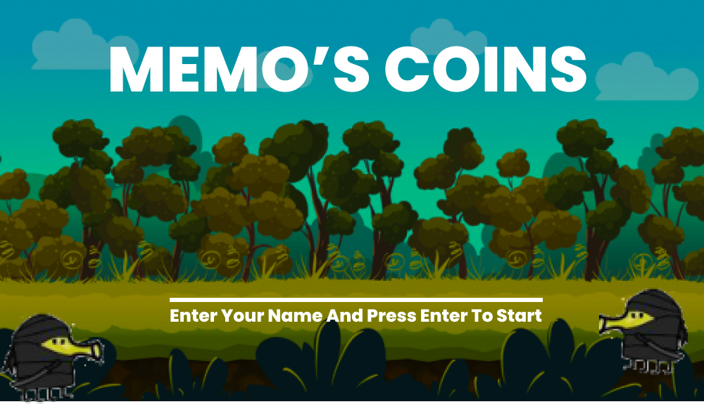
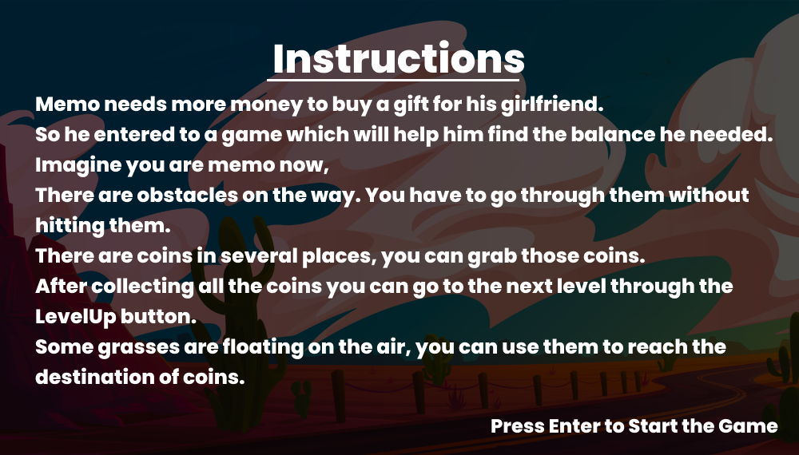
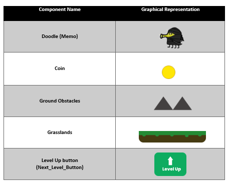

# Memo_Game
<h2>Basic Documentation</h1>
Introduction about memo’s Coins.
The memo is about a ninja who falls in love with his girlfriend. Memo needs more money to buy a gift for his girlfriend. In this game memo is the player and we have to collect all coins while facing the obstacles. There are 5 initial game levels in this game. Players need to pass all levels to win the game.
The Memo’s Coin is the graphical 2D game.
 

 

<h2>Instructions</h2>

 

 
<h2>Game Components</h2>

